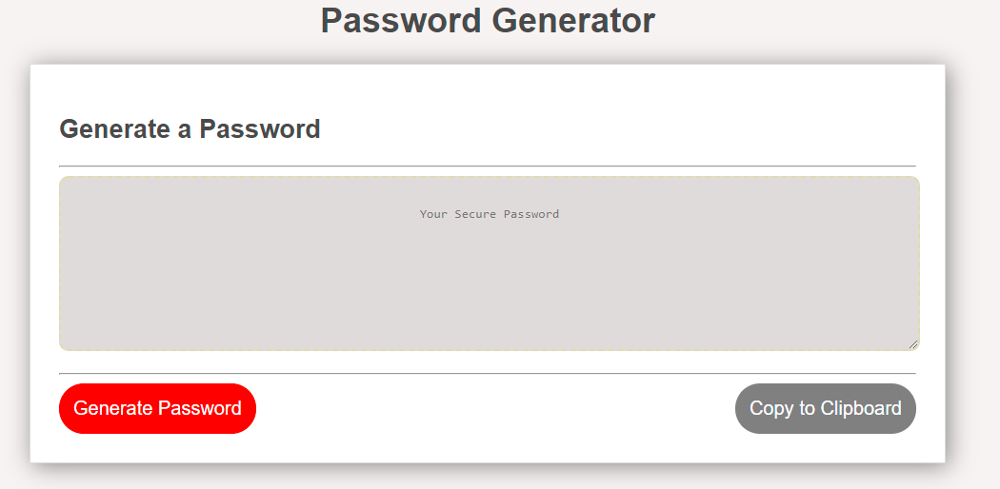
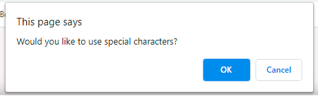
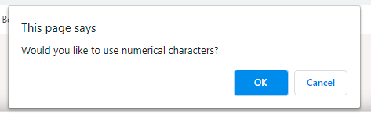
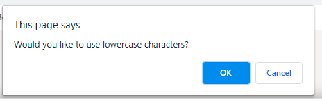
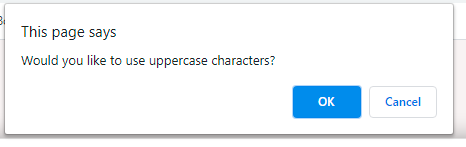
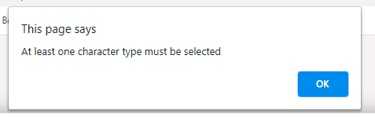

# Password-Generator

## Description

This application generates a random password based on user-selected criteria.
The application validates user input and ensure that at least one character type is selected.
Once all prompts are answered, the user will be presented with a password matching the answered prompts.
This application is also responsive, ensuring that it adapts to multiple screen sizes.

## Installation

Please visit the deployed project at: https://XRXXRXRXRXRXRXRXRXRXRXRXRXRXRXRX/ 

## Usage
Add more information to this section 

### Instructions

Create an application that generates a random password based on user-selected criteria. This app will run in the browser and feature dynamically updated HTML and CSS powered by your JavaScript code.
The user will be prompted to choose from the following password criteria:
1. Length (must be between 8 and 128 characters)
2. Character type:

    * Special characters: 

    * Numeric characters: 

    * Lowercase characters: 

    * Uppercase characters: 

3. The user MUST choose at least one charachter type or they will be prompted.

