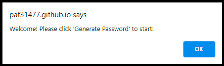
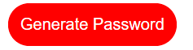
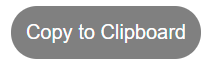
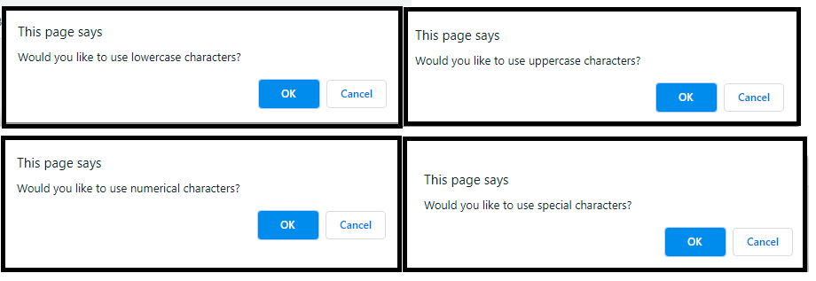

# Password-Generator

This project is a homework assignment for Rutgers coding bootcamp. 

This application uses Javascript to generate a random, secure password for the user. 

### Technolgy Used

This application was built with HTML, CSS and JavaScript.

## Getting Started

This project has been deployed to GitHub Pages. To run this project, you can follow the deployment link. Or, download the sources files to use as a template.

* [GitHub Repository](https://github.com/pat31477/Password-Generator)
* [Deployed Page](https://pat31477.github.io/Password-Generator/.)

### Deployed application screen shot

### Prerequisites
You will need a text editor if you intend on installing this application. Visual Studio Code is recommended.

### Installing

You can copy the raw code to install or feel free to clone the repository. 

### Summary
* HTML, CSS, and Javascript documents create a random password generator.
* This project uses Javascript to make dynamic changes to an HMTL document.
* Images provided display functionality of the application.

### This project has the following features:
* A window alert
    * "Welcome! Please click 'Generate Password' to start!"

* A generate button
    * This will send the user a series of prompts and confirms
    * After user data is collected, a random password will be generated using Javascript

* A Text area
    * This text area will display the users password once it is generated

* A Copy button 
    * This will copy the generated password to the user's devices clipboard

### Project Requirements: 
* The user will be prompted to choose from the following password criteria: 8 and 128 characters

* The user will recieve a confirm for: 
    * Password containing lower case, upper case, special characters, numbers.
    * This will need to randomly generate a selection or randomly select data, so math.random and math.floor will need to be used.     
* The application will validate user input and ensure that at least one character type is selected.
* Once all prompts are answered, the user will be presented with a password matching the answered prompts.
* Event listener will determine the password output with function to populate the value into the test area.
* As a bonus, the user should also have the option to click a button to copy the password to their clipboard.
    * Copy execCommand in event listener

### This project has script features of:
* Variable declaration area 
* An event listener (onclick) called generatePassword
    * This will prompt the user for input between 8-128
    * A While loop will validate that the input is a number within range, or is a number
    * This then uses the input to determine the types (or choices) or letters of characters used, using an if statement
    * This then assigns values to the variables using arrays for character, number or alphabet
* Another variable is created to concatenate the above variables
* A for loop will loop through the enter prompt until it reaches the number entered by user. 
* A password variable takes the value from the for loop, and converts it to a string. 
* The string value then populates into the text area for the user using a UserInput function.
* An event listener (onlick) has also been created for the copy to clipboard feauture. 

### To Execute File:
> Open in browser

### Features: 
* One HTML Pages
    * Index.html 
        * Contains basic user input items and buttons with divs and ids
* One CSS Page
    * Styles.css
        * Contains centering and styling for html user input features
* One Javascript Page
        * Contains: 
        * Variables
        * While Loop
        * Various if statements
        * One For Loop

* **Patrick E. Walker** - [Git Hub Profile](https://github.com/pat31477)

## Acknowledgments for advice and assistance:

* Steve Marsh (https://github.com/Imaparadox)

* Ben Durham (https://github.com/bdurham227)

* Gabe Thomas (https://github.com/samohtebag)

* Jason Barbanel (https://github.com/Jbarbss)

* Takuya Matsumoto (https://github.com/TakuyaMats)

### Licensing: 
* Copyright (c) 2021 Patrick E. Walker

Permission is hereby granted, free of charge, to any person obtaining
a copy of this software and associated documentation files (the
"Software"), to deal in the Software without restriction, including
without limitation the rights to use, copy, modify, merge, publish,
distribute, sublicense, and/or sell copies of the Software, and to
permit persons to whom the Software is furnished to do so, subject to
the following conditions:

The above copyright notice and this permission notice shall be
included in all copies or substantial portions of the Software.

THE SOFTWARE IS PROVIDED "AS IS", WITHOUT WARRANTY OF ANY KIND,
EXPRESS OR IMPLIED, INCLUDING BUT NOT LIMITED TO THE WARRANTIES OF
MERCHANTABILITY, FITNESS FOR A PARTICULAR PURPOSE AND
NONINFRINGEMENT. IN NO EVENT SHALL THE AUTHORS OR COPYRIGHT HOLDERS BE
LIABLE FOR ANY CLAIM, DAMAGES OR OTHER LIABILITY, WHETHER IN AN ACTION
OF CONTRACT, TORT OR OTHERWISE, ARISING FROM, OUT OF OR IN CONNECTION
WITH THE SOFTWARE OR THE USE OR OTHER DEALINGS IN THE SOFTWARE.

